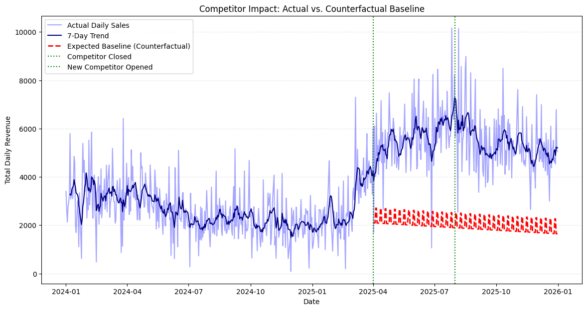

# Competitor Impact on Small Retail Sales

A SQL‑driven study of how a nearby competitor’s closure and reopening affected a neighborhood store’s revenue, customer volume, and spending patterns.

## Background
A local competitor closed in early 2025 and a new competitor reopened later in 2025. The owner noticed higher sales during the closure and suspected partial loss after reopening. This project quantifies that impact using real POS transactions.

### The questions I wanted to answer through my SQL queries were:
- Did daily transaction volume change across the three periods?
- Did total revenue and daily sales shift after each event?
- Was growth driven by more customers or higher spending per customer?
- Were weekends affected differently from weekdays?
- How quickly did customers react to the competitor closure?
- Did sales return to previous levels after the new competitor opened?
- What would sales have been if the competitor never closed? (counterfactual baseline)

## Data
This dataset contains 9,477 transactions from 2024‑01‑01 to 2025‑12‑31. Each record includes date, transaction ID, bill amount, and payment type, and the data comes directly from a family‑owned neighborhood store POS system.

## Event Windows
Sales were split into three periods:
- **Pre‑Closure:** before 2025‑04‑01  
- **Post‑Closure:** 2025‑04‑01 to 2025‑07‑31  
- **Post‑Opening:** 2025‑08‑01 onward  

## Tools I Used
- **SQL (PostgreSQL):** The core of the project, used for cleaning the dataset, defining event periods, and generating all analytical metrics.
- **Python (pandas):** Used to build the counterfactual baseline that estimates sales if no competitor changes occurred.
- **Power BI:** Used to build the interactive dashboard and present the results clearly.
- **Visual Studio Code:** My main environment for writing and organizing SQL and Python files.

## Power BI Dashboard
[View Interactive Power BI Dashboard](https://app.powerbi.com/groups/me/reports/cac760c2-e0f3-40d9-8c77-4426f9cd8cc0/fff278654c1dba434367?ctid=d2028c43-df44-4ef6-9b89-67a339c53d23&experience=power-bi)

## The Analysis
Each query in this project is tied to a specific business question. The goal was not just to show what changed, but to explain how and why it changed.

### Descriptive Analysis (What is happening?)
**1. Daily Revenue & Average Transaction Value**  

To check consistency at the day level, I looked at daily revenue and average bill size.

```sql
WITH daily_sales AS (
    SELECT
        s.date,
        p.period_name AS period,
        p.period_order,
        SUM(s.total_amt) AS daily_sales,
        COUNT(*) AS daily_transaction_count
    FROM sales s
    JOIN vw_period p ON s.date = p.date
    GROUP BY 1,2,3
)

SELECT period,
       AVG(daily_sales) AS avg_daily_sales,
       AVG(daily_transaction_count) AS avg_daily_transactions
FROM daily_sales
GROUP BY period, period_order
ORDER BY period_order;
```

After closure, the daily revenue distribution shifts upward across normal days, not just a few outliers. This suggests the uplift was broad‑based, meaning more customers were coming in consistently rather than a handful of unusually large days driving the results.


**2. Monthly Revenue Trend**  

To identify long‑term shifts, I analyzed revenue by month across two years.

```sql
WITH monthly_sales AS (
    SELECT DATE_TRUNC('month', s.date) AS month,
           p.period_name AS period,
           p.period_order, 
           SUM(s.total_amt) AS monthly_sales,
           COUNT(*) AS monthly_transaction_count
    FROM sales s
    JOIN vw_period p ON s.date = p.date
    GROUP BY 1,2,3
)

SELECT period,
       AVG(monthly_sales) AS avg_monthly_sales,
       AVG(monthly_transaction_count) AS avg_monthly_transactions
FROM monthly_sales
GROUP BY 1, period_order
ORDER BY period_order;
```

The trend declines through 2024 and then rises sharply starting April 2025. This timing aligns precisely with the competitor closure and breaks the previous downward pattern. That timing makes it unlikely that the jump was random noise or seasonal fluctuation; it looks like an event‑driven shift.


### Diagnostic Analysis (How is it happening?)
**3. Volume vs. Basket Size**  

To determine the main driver of growth, I compared transaction volume with average bill size.

```sql
WITH daily_metrics AS (
    SELECT
        date,
        COUNT(*) AS daily_transactions,
        AVG(total_amt) AS daily_avg_bill
    FROM sales
    GROUP BY date
),
labeled AS (
    SELECT
        d.*,
        p.period_name,
        p.period_order
    FROM daily_metrics d
    JOIN vw_period p ON d.date = p.date
)

SELECT
    period_name,
    AVG(daily_transactions) AS avg_daily_transactions,
    AVG(daily_avg_bill) AS avg_bill_value
FROM labeled
GROUP BY period_name, period_order
ORDER BY period_order;
```

The closure period shows a clear rise in daily transactions, while average bill size also increases but at a smaller scale. This indicates the uplift was primarily volume‑led. After reopening, transaction volume drops slightly, but higher average bill values remain, which helps keep revenue elevated even as some customers return to the competitor. The pattern reinforces that the store’s health depends more on consistent footfall than unusually large baskets.


**4. Weekday vs. Weekend Effect**  

To test whether the uplift was limited to weekends, I compared weekday and weekend performance.

```sql
WITH daily_sales AS (
    SELECT
        s.date,
        p.period_name,
        COUNT(DISTINCT s.bill_no) AS bills_per_day,
        SUM(s.total_amt) AS sales_per_day,
        AVG(s.total_amt) AS avg_bill_value,
        CASE WHEN EXTRACT(DOW FROM s.date) IN (0, 6) THEN 'Weekend' ELSE 'Weekday' END AS day_type,
        p.period_order
    FROM sales s
    JOIN vw_period p ON s.date = p.date
    GROUP BY 1,2,6,7
)

SELECT
    period_name,
    day_type,
    AVG(bills_per_day) AS avg_daily_transactions,
    AVG(sales_per_day) AS avg_daily_sales,
    AVG(avg_bill_value) AS avg_bill_value
FROM daily_sales
GROUP BY period_name, period_order, day_type
ORDER BY period_order, day_type;
```

Weekdays improved significantly after closure, which is a stronger signal of routine customer adoption. If growth were only weekend‑driven, it would suggest bulk or occasional visits; the weekday uplift indicates that many customers shifted their daily convenience shopping to this store.


### Impact / Retention Analysis (What changed after events?)
**5. Consistency & Volatility (Mean, Median, Std Dev)**  

To check whether the uplift was stable, I compared mean and median daily sales and measured volatility across periods.

```sql
WITH daily_sales AS (
    SELECT
        s.date,
        p.period_name,
        SUM(s.total_amt) AS sales_per_day,
        AVG(s.total_amt) AS avg_bill_value,
        CASE WHEN EXTRACT(DOW FROM s.date) IN (0, 6) THEN 'Weekend' ELSE 'Weekday' END AS day_type,
        p.period_order
    FROM sales s
    JOIN vw_period p ON s.date = p.date
    GROUP BY 1,2,5,6
)

SELECT period_name,
       AVG(sales_per_day) mean_daily_sales,
       PERCENTILE_CONT(0.5) WITHIN GROUP (ORDER BY sales_per_day) AS median_daily_sales,
       STDDEV(sales_per_day) AS stddev_daily_sales,
       MIN(sales_per_day) AS min_daily_sales,
       MAX(sales_per_day) AS max_daily_sales
FROM daily_sales
GROUP BY 1, period_order
ORDER BY period_order
;
```
Mean and median stayed close in the uplift period, indicating the increase was steady across days rather than driven by outliers. Volatility remained controlled even as revenue rose, which is a strong sign that the uplift reflects a structural shift rather than noise.


**6. Retention of Captured Revenue**  
To quantify how much of the uplift persisted after reopening, I measured retention across periods.

```sql
WITH daily_sales AS (
    SELECT
        s.date,
        p.period_name,
        p.period_order,
        SUM(s.total_amt) AS daily_sales
    FROM sales s
    JOIN vw_period p ON s.date = p.date
    GROUP BY 1,2,3
),

period_avg AS (
    SELECT
        period_name,
        period_order,
        AVG(daily_sales) AS avg_daily_sales
    FROM daily_sales
    GROUP BY 1,2
),

pivot AS (
    SELECT
        MAX(CASE WHEN period_name = 'Pre-Closure' THEN avg_daily_sales END) AS pre_closure_avg,
        MAX(CASE WHEN period_name = 'Post-Closure' THEN avg_daily_sales END) AS post_closure_avg,
        MAX(CASE WHEN period_name = 'Post-Opening' THEN avg_daily_sales END) AS post_opening_avg
    FROM period_avg
)

SELECT
    ROUND(pre_closure_avg, 2) AS pre_closure_avg_daily_sales,
    ROUND(post_closure_avg, 2) AS post_closure_avg_daily_sales,
    ROUND(post_opening_avg, 2) AS post_opening_avg_daily_sales,

    ROUND((post_closure_avg - pre_closure_avg), 2) AS uplift_captured_post_closure_avg,
    ROUND((post_closure_avg - post_opening_avg), 2) AS uplift_lost_post_opening_avg,

    ROUND(
        ((post_opening_avg - pre_closure_avg) / NULLIF((post_closure_avg - pre_closure_avg), 0)) * 100.0
    , 2) AS retention_percent_post_opening_avg
FROM pivot;
```

A meaningful share of the post‑closure uplift remained after the competitor returned, showing that the store converted a portion of new shoppers into retained customers instead of losing all gains.


### Predictive Analysis (What would have happened without the events?)
A baseline model trained on pre‑closure data projects expected sales after April 2025 if no competitor changes occurred. Actual revenue stays far above this projected baseline across the event period, confirming that the uplift was not just seasonal drift but a true competitor‑driven impact.



## What I Learned
The closure created an immediate and sustained increase in daily revenue, driven primarily by higher customer volume. Even after a new competitor reopened, sales remained elevated because average bill values stayed higher. Importantly, weekday sales improved along with weekends, indicating the store captured routine shoppers, not just occasional buyers.


## Limitations
This analysis has no external control store, so the counterfactual relies on pre‑closure trends. Seasonal patterns may also influence results, and the baseline assumes stable pre‑closure behavior.


## Conclusions

### Insights
The competitor closure acted as a trial period that converted a meaningful number of new customers. Even after competition returned, the store retained a significant portion of the uplift, suggesting the change was structural rather than temporary.

### Business Implications
The store should:
- Focus promotions on high‑traffic weekend days.
- Invest in loyalty incentives to retain new customers.
- Expand inventory for routine household purchases.
- Encourage digital payments to push average basket size higher.
