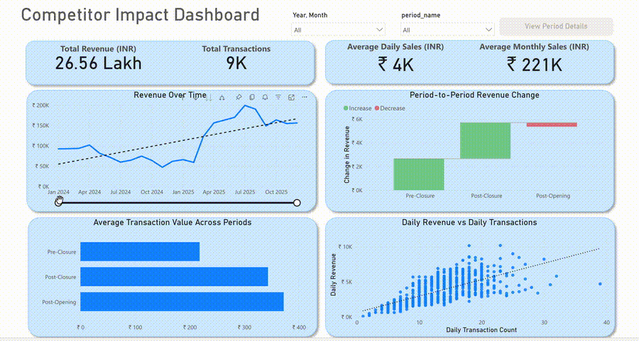

# Competitor Impact on Small Retail Sales

A SQL‑driven study of how a nearby competitor’s closure and reopening affected a neighborhood store’s revenue, customer volume, and spending patterns.

## Background
A local competitor closed in early 2025 and a new competitor reopened later in 2025. The owner noticed higher sales during the closure and suspected partial loss after reopening. This project quantifies that impact using real POS transactions.

### The questions I wanted to answer through my SQL queries were:
- Did daily transaction volume change across the three periods?
- Did total revenue and daily sales shift after each event?
- Was growth driven by more customers or higher spending per customer?
- Were weekends affected differently from weekdays?
- How quickly did customers react to the competitor closure?
- Did sales return to previous levels after the new competitor opened?
- What would sales have been if the competitor never closed? (counterfactual baseline)

## Data
This dataset contains 9,477 transactions from 2024‑01‑01 to 2025‑12‑31. Each record includes date, transaction ID, bill amount, and payment type, and the data comes directly from a family‑owned neighborhood store POS system.

## Event Windows
Sales were split into three periods:
- **Pre‑Closure:** before 2025‑04‑01  
- **Post‑Closure:** 2025‑04‑01 to 2025‑07‑31  
- **Post‑Opening:** 2025‑08‑01 onward  

## Tools I Used
- **SQL (PostgreSQL):** The core of the project, used for cleaning the dataset, defining event periods, and generating all analytical metrics.
- **Python (pandas):** Used to build the counterfactual baseline that estimates sales if no competitor changes occurred.
- **Power BI:** Used to build the interactive dashboard and present the results clearly.
- **Visual Studio Code:** My main environment for writing and organizing SQL and Python files.

## Power BI Dashboard

[:bar_chart: View Interactive Power BI Dashboard](https://app.powerbi.com/view?r=eyJrIjoiYmI4OTIwMTMtOThhYi00MGRlLTlmNTktZjQ4NTEwODcwN2M3IiwidCI6ImQyMDI4YzQzLWRmNDQtNGVmNi05Yjg5LTY3YTMzOWM1M2QyMyJ9&pageName=fff278654c1dba434367)

## The Analysis
Each query in this project is tied to a specific business question. The goal was not just to show what changed, but to explain how and why it changed.

### Descriptive Analysis (What is happening?)
**1. Transaction Value Distribution**  

To understand baseline purchase behavior, I measured the average, minimum, and maximum bill values.

```sql
SELECT AVG(total_amt) avg_transaction_value,
       MIN(total_amt) min_transaction_value,
       MAX(total_amt) max_transaction_value
FROM sales s;
```

The average transaction value is ~₹280, with a minimum of ₹5 and a maximum of ₹2,260. This wide range shows that while a few large baskets occur, most purchases are small. The low average compared to the max confirms the store’s core business is built on frequent, low‑value transactions rather than occasional high‑value bills.


**2. Monthly Revenue Trend**  

To identify long‑term shifts, I analyzed revenue by month across two years.

```sql
SELECT DATE_TRUNC('month', date) AS month,
       SUM(total_amt) as total_amt_monthly,
       COUNT(*) AS transaction_count
FROM sales
GROUP BY 1
ORDER BY 1;
```

Looking at total monthly revenue across 2024–2025, the series shows a lower, declining band through 2024, followed by a clear jump beginning in April 2025. The highest monthly totals in the entire dataset appear in 2025, and the lift is sustained across multiple months rather than being a one‑time spike. That shift is visible directly in the month‑to‑month totals.


*Image showing total monthly revenue across 2024–2025 with a trend line highlighting the shift in sales levels. Generated using Power BI.*


### Diagnostic Analysis (How is it happening?)
**3. Volume vs. Basket Size**  

To determine the main driver of growth, I compared transaction volume with average bill size.

```sql
WITH daily_metrics AS (
    SELECT
        date,
        COUNT(*) AS daily_transactions,
        AVG(total_amt) AS daily_avg_bill
    FROM sales
    GROUP BY date
),
labeled AS (
    SELECT
        d.*,
        p.period_name,
        p.period_order
    FROM daily_metrics d
    JOIN vw_period p ON d.date = p.date
)

SELECT
    period_name,
    AVG(daily_transactions) AS avg_daily_transactions,
    AVG(daily_avg_bill) AS avg_bill_value
FROM labeled
GROUP BY period_name, period_order
ORDER BY period_order;
```

Average daily transactions rose from ~12.2 (pre‑closure) to ~16.6 (post‑closure), while average bill value increased from ~₹228.6 to ~₹351.9. After reopening, transactions fell to ~14.4 but average bill value stayed high at ~₹379.7, keeping revenue elevated. The pattern indicates the initial lift was volume‑led, while higher basket value helped sustain revenue after competition returned.


**4. Weekday vs. Weekend Effect**  

To test whether the uplift was limited to weekends, I compared weekday and weekend performance.

```sql
WITH daily_sales AS (
    SELECT
        s.date,
        p.period_name,
        COUNT(DISTINCT s.bill_no) AS bills_per_day,
        SUM(s.total_amt) AS sales_per_day,
        AVG(s.total_amt) AS avg_bill_value,
        CASE WHEN EXTRACT(DOW FROM s.date) IN (0, 6) THEN 'Weekend' ELSE 'Weekday' END AS day_type,
        p.period_order
    FROM sales s
    JOIN vw_period p ON s.date = p.date
    GROUP BY 1,2,6,7
)

SELECT
    period_name,
    day_type,
    AVG(bills_per_day) AS avg_daily_transactions,
    AVG(sales_per_day) AS avg_daily_sales,
    AVG(avg_bill_value) AS avg_bill_value
FROM daily_sales
GROUP BY period_name, period_order, day_type
ORDER BY period_order, day_type;
```

Before closure, weekdays averaged ₹2,482 and weekends ₹3,089 in daily sales. After closure, both nearly doubled with weekdays being ~₹5,398 and weekends ~₹6,442. Post‑opening, weekdays held at ~₹5,015 and weekends at ~₹6,185. The uplift is not just a weekend effect; weekday sales also climbed sharply, showing routine customers shifted their regular shopping behavior.


### Impact / Retention Analysis (What changed after events?)
**5. Consistency & Volatility (Mean, Median, Std Dev)**  

To check whether the uplift was stable, I compared mean and median daily sales and measured volatility across periods.

```sql
WITH daily_sales AS (
    SELECT
        s.date,
        p.period_name,
        SUM(s.total_amt) AS sales_per_day,
        AVG(s.total_amt) AS avg_bill_value,
        CASE WHEN EXTRACT(DOW FROM s.date) IN (0, 6) THEN 'Weekend' ELSE 'Weekday' END AS day_type,
        p.period_order
    FROM sales s
    JOIN vw_period p ON s.date = p.date
    GROUP BY 1,2,5,6
)

SELECT period_name,
       AVG(sales_per_day) mean_daily_sales,
       PERCENTILE_CONT(0.5) WITHIN GROUP (ORDER BY sales_per_day) AS median_daily_sales,
       STDDEV(sales_per_day) AS stddev_daily_sales,
       MIN(sales_per_day) AS min_daily_sales,
       MAX(sales_per_day) AS max_daily_sales
FROM daily_sales
GROUP BY 1, period_order
ORDER BY period_order
;
```
Pre‑closure daily sales averaged ~₹2,658, with a median of ₹2,559 and standard deviation of ₹1,077. Post‑closure, the mean rose to ~₹5,691 and the median to ₹5,644, with volatility at ~₹1,238. Post‑opening, the mean stayed high at ~₹5,353, median ₹5,201, and volatility ~₹1,169. The mean and median remain close across periods, and volatility doesn’t spike, confirming the uplift is steady and structural rather than driven by a few outlier days.


**6. Retention of Captured Revenue**  
To quantify how much of the uplift persisted after reopening, I measured retention across periods.

```sql
WITH daily_sales AS (
    SELECT
        s.date,
        p.period_name,
        p.period_order,
        SUM(s.total_amt) AS daily_sales
    FROM sales s
    JOIN vw_period p ON s.date = p.date
    GROUP BY 1,2,3
),

period_avg AS (
    SELECT
        period_name,
        period_order,
        AVG(daily_sales) AS avg_daily_sales
    FROM daily_sales
    GROUP BY 1,2
),

pivot AS (
    SELECT
        MAX(CASE WHEN period_name = 'Pre-Closure' THEN avg_daily_sales END) AS pre_closure_avg,
        MAX(CASE WHEN period_name = 'Post-Closure' THEN avg_daily_sales END) AS post_closure_avg,
        MAX(CASE WHEN period_name = 'Post-Opening' THEN avg_daily_sales END) AS post_opening_avg
    FROM period_avg
)

SELECT
    ROUND(pre_closure_avg, 2) AS pre_closure_avg_daily_sales,
    ROUND(post_closure_avg, 2) AS post_closure_avg_daily_sales,
    ROUND(post_opening_avg, 2) AS post_opening_avg_daily_sales,

    ROUND((post_closure_avg - pre_closure_avg), 2) AS uplift_captured_post_closure_avg,
    ROUND((post_closure_avg - post_opening_avg), 2) AS uplift_lost_post_opening_avg,

    ROUND(
        ((post_opening_avg - pre_closure_avg) / NULLIF((post_closure_avg - pre_closure_avg), 0)) * 100.0
    , 2) AS retention_percent_post_opening_avg
FROM pivot;
```

The post‑closure uplift over the pre‑closure baseline was ~₹3,033 per day. After reopening, only ~₹338 per day of that uplift was lost, which implies ~88.9% of the uplift was retained. This indicates that most of the customers gained during the closure continued shopping even after the competitor returned.


### Predictive Analysis (What would have happened without the events?)
After the competitor closed, actual daily sales moved sharply above the expected baseline (red dashed line), and the 7‑day trend (dark blue) stayed elevated for the rest of the period. The gap between actuals (blue) and the baseline remained wide across months, which points to a durable uplift rather than a short‑lived spike. Even after the new competitor opened, sales stayed well above the projected baseline, showing that a large share of the gained demand persisted.


*Image showing daily revenue across the full timeline alongside the counterfactual baseline and event markers for competitor closure and reopening. Generated using Power BI.*


## What I Learned
The closure created an immediate and sustained increase in daily revenue, driven primarily by higher customer volume. Even after a new competitor reopened, sales remained elevated because average bill values stayed higher. Importantly, weekday sales improved along with weekends, indicating the store captured routine shoppers, not just occasional buyers.


## Limitations
This analysis has no external control store, so the counterfactual relies on pre‑closure trends. Seasonal patterns may also influence results, and the baseline assumes stable pre‑closure behavior.


## Conclusions

### Insights
The competitor closure acted as a trial period that converted a meaningful number of new customers. Even after competition returned, the store retained a significant portion of the uplift, suggesting the change was structural rather than temporary.

### Business Implications
The store should:
- Focus promotions on high‑traffic weekend days.
- Invest in loyalty incentives to retain new customers.
- Expand inventory for routine household purchases.
- Encourage digital payments to push average basket size higher.
